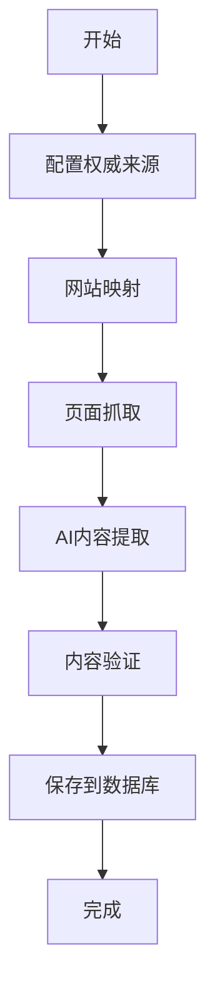

# Firecrawl母婴内容爬虫指南

> **版本**: 1.0  
> **最后更新**: 2024-10-11  
> **基于**: Firecrawl MCP工具

---

## 🚀 概述

Firecrawl版本的母婴内容爬虫使用Firecrawl的AI能力来抓取和提取权威网站的母婴健康信息。相比传统的cheerio+axios爬虫，Firecrawl提供了更智能的内容提取和结构化数据处理。

## 🔥 Firecrawl优势

### 1. **AI驱动的智能提取**
- 自动识别主要内容区域
- 智能过滤广告和无关内容
- 保持内容结构和格式

### 2. **结构化数据生成**
- 自动提取标题、摘要、关键点
- 识别年龄范围、分类、医疗建议
- 生成标准化的JSON格式数据

### 3. **多格式支持**
- Markdown格式输出
- HTML保留
- 纯文本提取
- 自定义结构化数据

### 4. **高级搜索功能**
- 网站内搜索
- 多语言支持
- 智能相关性过滤

## 📁 文件结构

```
scripts/
├── firecrawl-scraper.js          # 基础Firecrawl爬虫
├── firecrawl-real-scraper.js     # 真实API集成版本
├── firecrawl-integration.js      # MCP集成演示版本
└── FIRECRAWL_SCRAPER_GUIDE.md   # 本文档
```

## 🛠️ 安装和配置

### 1. 环境要求
```bash
# 确保有Node.js环境
node --version  # >= 16.0.0

# 安装依赖
cd nextjs-project
npm install
```

### 2. 环境变量配置
```bash
# .env.local 文件中需要包含:
NEXT_PUBLIC_SUPABASE_URL=your_supabase_url
SUPABASE_SERVICE_ROLE_KEY=your_service_role_key

# 可选配置
DEBUG=true  # 启用调试模式
```

### 3. Firecrawl API配置
```bash
# 如果需要使用真实Firecrawl API，添加:
FIRECRAWL_API_KEY=your_firecrawl_api_key
```

## 🎯 使用方法

### 快速开始

```bash
# 1. 运行演示版本（推荐）
node scripts/firecrawl-integration.js

# 2. 运行基础版本
node scripts/firecrawl-scraper.js

# 3. 运行真实API版本（需要API密钥）
node scripts/firecrawl-real-scraper.js
```

### 配置选项

```javascript
const CONFIG = {
  maxArticlesPerRun: 30,        // 最大抓取文章数
  minContentLength: 500,        // 最小内容长度
  debugMode: false,             // 调试模式
  delayBetweenRequests: 2000,   // 请求间隔(ms)
  regions: ['US', 'UK', 'CA']   // 目标地区
};
```

## 🔍 Firecrawl工具使用

### 1. 网页搜索 (`firecrawl_search`)

```javascript
// 搜索特定主题
const searchResults = await firecrawl_search({
  query: "infant nutrition guidelines",
  limit: 5,
  sources: [{ type: "web" }]
});
```

### 2. 页面抓取 (`firecrawl_scrape`)

```javascript
// 抓取单个页面
const pageContent = await firecrawl_scrape({
  url: "https://www.healthychildren.org/...",
  formats: ["markdown"],
  onlyMainContent: true,
  removeBase64Images: true
});
```

### 3. 网站映射 (`firecrawl_map`)

```javascript
// 发现网站所有相关页面
const siteMap = await firecrawl_map({
  url: "https://www.nhs.uk",
  search: "baby feeding",
  limit: 50
});
```

### 4. AI提取 (`firecrawl_extract`)

```javascript
// 使用AI提取结构化数据
const extractedData = await firecrawl_extract({
  urls: ["https://example.com/article"],
  prompt: "Extract medical advice and key points",
  schema: {
    type: "object",
    properties: {
      title: { type: "string" },
      summary: { type: "string" },
      keyPoints: { type: "array" },
      ageRange: { type: "string" }
    }
  }
});
```

## 📊 权威来源配置

### 美国 (US)
- **AAP (American Academy of Pediatrics)**: 儿科医学权威
- **Mayo Clinic**: 综合性医疗中心
- **CDC**: 疾病控制与预防中心

### 英国 (UK)
- **NHS**: 国家医疗服务体系
- **NHS Start4Life**: 政府母婴健康计划

### 加拿大 (CA)
- **Health Canada**: 加拿大卫生部
- **Caring for Kids**: 加拿大儿科协会

## 🎯 数据提取流程



### 详细步骤

1. **网站映射**: 发现所有相关页面
2. **内容抓取**: 使用AI提取主要内容
3. **结构化处理**: 生成标准化数据格式
4. **质量验证**: 检查内容质量和相关性
5. **数据库存储**: 保存到Supabase

## 🔧 自定义配置

### 添加新的权威来源

```javascript
const newSource = {
  name: 'New Authority',
  organization: 'NewOrg',
  baseUrl: 'https://example.com',
  region: 'US',
  grade: 'A',
  targetPages: [
    'https://example.com/article1',
    'https://example.com/article2'
  ],
  searchTerms: ['baby nutrition', 'infant care']
};
```

### 自定义提取模式

```javascript
const customExtract = {
  prompt: "Extract the following information: title, summary, key medical advice, age recommendations, and safety notes",
  schema: {
    type: "object",
    properties: {
      title: { type: "string" },
      summary: { type: "string" },
      medicalAdvice: { type: "string" },
      ageRange: { type: "string" },
      safetyNotes: { type: "string" }
    }
  }
};
```

## 📈 性能优化

### 1. 并发控制
```javascript
const CONCURRENCY_LIMIT = 2;  // 同时最多2个请求
const DELAY_BETWEEN_REQUESTS = 2000;  // 2秒延迟
```

### 2. 缓存策略
```javascript
const CACHE_CONFIG = {
  enabled: true,
  ttl: 86400000,  // 24小时缓存
  directory: './cache/firecrawl'
};
```

### 3. 错误处理
```javascript
const RETRY_CONFIG = {
  maxRetries: 3,
  retryDelay: 1000,
  backoffMultiplier: 2
};
```

## 🐛 故障排除

### 常见问题

1. **API配额限制**
   ```
   解决方案: 增加请求延迟，减少并发数
   ```

2. **内容质量低**
   ```
   解决方案: 调整最小内容长度，改进验证规则
   ```

3. **网站访问限制**
   ```
   解决方案: 使用代理，调整User-Agent
   ```

### 调试模式

```bash
# 启用详细日志
DEBUG=true node scripts/firecrawl-integration.js

# 查看抓取统计
node scripts/firecrawl-integration.js --stats

# 测试单个来源
node scripts/firecrawl-integration.js --source AAP
```

## 📊 监控和分析

### 抓取统计

```javascript
const stats = {
  total: 0,        // 总处理数
  successful: 0,   // 成功数
  failed: 0,       // 失败数
  skipped: 0       // 跳过数
};
```

### 质量指标

- **内容长度**: 平均字数
- **置信度**: AI提取置信度
- **来源权威性**: 权威等级评分
- **重复率**: 内容重复检测

## 🔄 与原有系统对比

| 特性 | 原系统 (cheerio+axios) | Firecrawl系统 |
|------|----------------------|---------------|
| 内容提取 | 手动CSS选择器 | AI自动识别 |
| 结构化数据 | 手动解析 | AI自动生成 |
| 内容质量 | 基础验证 | AI质量评估 |
| 维护成本 | 高（需更新选择器） | 低（自适应） |
| 准确性 | 中等 | 高 |
| 处理速度 | 快 | 中等（AI处理时间） |

## 🚀 未来改进

1. **多语言支持**: 扩展到其他语言内容
2. **实时监控**: 添加实时抓取状态监控
3. **机器学习**: 使用ML模型改进内容分类
4. **API集成**: 直接集成Firecrawl API
5. **可视化界面**: 添加Web管理界面

## 📞 支持和反馈

如有问题或建议，请：
1. 查看日志文件
2. 检查配置设置
3. 联系开发团队

---

**注意**: 使用Firecrawl时请遵守相关网站的使用条款和robots.txt规则。
